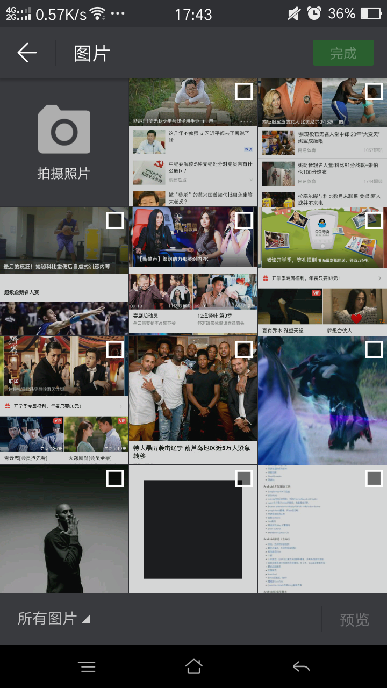
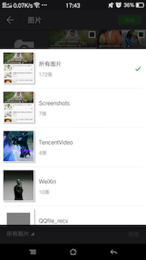

# PictureSelector

这是一个仿微信的图片选择器。

效果图：

* 选择界面



* 预览界面


* 裁剪界面


* 选择文件目录界面



## Features

1、图片来源：拍照，本地图片媒体库中jpg和png类型的图片

2、功能：多选、单选、拍照、预览、裁剪

3、todo：优化细节（一些动画）、整理解析文档

## Demo下载地址


[PicSelector下载地址](app/PicSelector.apk)

## Usage

1、引用Lib（Android studio）

通过引用Module方式引用，这样会更方便定制

* 在AndroidManifest.xml文件中添加：

```
<uses-permission android:name="android.permission.CAMERA"/>
<uses-permission android:name="android.permission.WRITE_EXTERNAL_STORAGE" />
<uses-permission android:name="android.permission.READ_EXTERNAL_STORAGE" />
...

<!--7.0以上拍照适配-->
<provider
	android:name="android.support.v4.content.FileProvider"
	android:authorities="项目包名.takephoto.fileprovider"
	android:exported="false"
	android:grantUriPermissions="true">
	<meta-data
		android:name="android.support.FILE_PROVIDER_PATHS"
		android:resource="@xml/file_paths" />
</provider>

<!--图片选择首页-->
<activity
    android:name="net.arvin.pictureselector.uis.SelectorActivity"
    android:screenOrientation="portrait" />
    
<!--只拍照和裁剪-->
<activity
	android:name="net.arvin.pictureselector.uis.TakePhotoAndCropActivity"
	android:screenOrientation="portrait" />
```

注意：provider的android:authorities属性把项目包名换成该项目的包名，因为在手机中，这个属性是不能重复的。

2、修改默认配置

```
／／这是默认设置
PSConfigUtil.getInstance().setCanCrop(false)
                .setCanTakePhoto(true)
                .setMaxCount(9)
                .setStatusBarColor(R.color.ps_colorPrimaryDark);
```
* setCanCrop 是否能裁剪，只有maxCount为1时才有效；
* setCanTakePhoto 是否支持拍照；
* setMaxCount 设置一次最多可选择图片的数量；
* setStatusBarColor 设置状态栏颜色，默认为值"#2f3034"。

3、启动PictureSelector：

```
private final int REQUEST_CODE_1 = 1001;
private ArrayList<ImageEntity> selectedImages;
...
PSConfigUtil.getInstance().showSelector(MainActivity.this, REQUEST_CODE_1, selectedImages);
／／或者不传参数，注意传递已选择图片的大小不能超过设置的最大数量
PSConfigUtil.getInstance().showSelector(MainActivity.this, REQUEST_CODE_1);
```

4、启动拍照

```
private final int REQUEST_CODE_2 = 1002;
PSConfigUtil.getInstance().showTakePhotoAndCrop(MainActivity.this, REQUEST_CODE_2);
```

5、接收选择的图片数据：

```
	@Override
    protected void onActivityResult(int requestCode, int resultCode, Intent data) {
        if (resultCode == RESULT_OK) {
            switch (requestCode) {
                case REQUEST_CODE_1: {
                    selectedImages.clear();
                    List<ImageEntity> temp = data.getParcelableArrayListExtra(PSConstanceUtil.PASS_SELECTED);
                    selectedImages.addAll(temp);

                    PSGlideUtil.loadImage(this, "file://" + temp.get(0).getPath(), img);
                    for (ImageEntity selectedImage : selectedImages) {
                        Log.d("back_data", selectedImage.getPath());
                    }
                    break;
                }
                case REQUEST_CODE_2: {
                    selectedImages.clear();
                    List<ImageEntity> temp = data.getParcelableArrayListExtra(PSConstanceUtil.PASS_SELECTED);
                    selectedImages.addAll(temp);

                    PSGlideUtil.loadImage(this, "file://" + temp.get(0).getPath(), img);
                    for (ImageEntity selectedImage : selectedImages) {
                        Log.d("back_data", selectedImage.getPath());
                    }
                    break;
                }
            }
        }
    }
```

6、清除图片缓存(删除)

* 清除裁剪图片：

```
PSCropUtil.clear();
```
* 清除拍照图片

```
PSTakePhotoUtil.clear();
```

* 清除所有

```
PSConfigUtil.clearCache();
```

## Thanks

* 图片预览在[PhotoView](https://github.com/chrisbanes/PhotoView)的基础上做了一定的修改；
* 图片裁剪使用了鸿洋大神的[仿微信头像裁剪](http://blog.csdn.net/lmj623565791/article/details/39761281),加载和裁剪算法并做了一定的修改。
* 大图显示使用了[SubsamplingScaleImageView](https://github.com/davemorrissey/subsampling-scale-image-view),并增加裁剪（还有优化空间）
* 图片加载使用Glide
* 事件传递使用Eventbus
* 异步操作使用了Rxjava和Rxandroid

在此表示感谢！

## License

```
   Copyright 2016 arvinljw

   Licensed under the Apache License, Version 2.0 (the "License");
   you may not use this file except in compliance with the License.
   You may obtain a copy of the License at

     http://www.apache.org/licenses/LICENSE-2.0

   Unless required by applicable law or agreed to in writing, software
   distributed under the License is distributed on an "AS IS" BASIS,
   WITHOUT WARRANTIES OR CONDITIONS OF ANY KIND, either express or implied.
   See the License for the specific language governing permissions and
   limitations under the License.
```